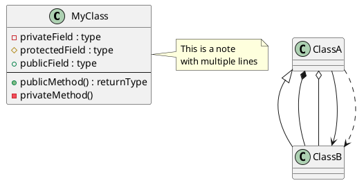

# R-Type Architecture Diagrams

This directory contains PlantUML diagrams documenting the R-Type project architecture.

## 📋 Available Diagrams

### 1. ECS Architecture (`01-ecs-architecture.puml`)
**Class diagram** showing the Entity-Component-System architecture used by the game server.

**Includes:**
- Core ECS elements (Entity, Component, System, Managers)
- All game components (Position, Velocity, Health, Player, Enemy, Boss, etc.)
- All game systems (Movement, Collision, Boss, Wave, etc.)
- Relationships and data flow

**Use when:** Understanding how the game engine is structured, how entities are managed, or how components interact with systems.

---

### 2. Network Protocol (`02-network-protocol.puml`)
**Class diagram** detailing the UDP-based network protocol and packet structures.

**Includes:**
- All packet types (C2S and S2C)
- OpCode enumeration
- Packet structure definitions
- NetworkServer and NetworkClient classes
- Reliability layer

**Use when:** Understanding network communication, implementing new packet types, or debugging network issues.

---

### 3. Game Loop Sequence (`03-game-loop-sequence.puml`)
**Sequence diagram** showing the execution flow of the game loop and system updates.

**Includes:**
- Input processing
- System update order
- Component queries
- Network synchronization (30 Hz)
- State update emission

**Use when:** Understanding game loop timing, system execution order, or network sync frequency.

---

### 4. Client Architecture (`04-client-architecture.puml`)
**Class diagram** showing the client-side architecture and components.

**Includes:**
- Main game loop structure
- All UI screens (Menu, Lobby, Settings, Replay Browser)
- Game entities (Player, Enemy, Boss, Projectile)
- Managers (Texture, Sound, Config)
- Network components (NetworkClient, ReplayRecorder, ReplayViewer)
- SFML wrapper interfaces

**Use when:** Understanding client structure, UI flow, or how rendering works.

---

### 5. Network Communication Flow (`05-network-flow.puml`)
**Sequence diagram** showing complete network communication between clients and server.

**Includes:**
- Connection phase (login)
- Game start sequence
- Gameplay loop (input → server → sync → render)
- Boss spawn event
- Game over sequence

**Use when:** Understanding multiplayer synchronization, packet flow, or debugging network issues.

---

### 6. Component-System Interaction (`06-component-system-interaction.puml`)
**Class diagram** showing how specific systems interact with components.

**Includes:**
- System requirements (which components each system needs)
- Example entities with their components
- System update logic pseudo-code
- Component read/write patterns

**Use when:** Implementing new systems, understanding component dependencies, or optimizing system queries.

---

### 7. Threading Architecture (`07-threading-architecture.puml`)
**Deployment diagram** showing multi-threading architecture for server and client.

**Includes:**
- Server threads (Main, Game, Network)
- Client threads (Main, Network)
- Thread-safe queues
- Synchronization mechanisms
- Performance characteristics

**Use when:** Understanding concurrency, debugging race conditions, or optimizing threading.

---

### 8. Wave System - Classes (`08-wave-system.puml`)
**Class diagram** showing level configuration data structures.

**Includes:**
- JSON level structure
- WaveLoader and WaveManager classes
- LevelDefinition, WaveDefinition structures
- SpawnPattern enum (SEQUENTIAL, SIMULTANEOUS, WAVE, FORMATION, RANDOM)
- Enemy configurations

**Use when:** Understanding level data structures, creating new levels, or adding new spawn patterns.

---

### 9. Wave System - Sequence (`08b-wave-system-sequence.puml`)
**Sequence diagram** showing wave spawning execution flow.

**Includes:**
- Level loading sequence
- Wave spawning logic per frame
- Pattern-specific spawning behavior
- Scheduled enemy spawns
- Boss spawn timing
- Wave completion detection

**Use when:** Understanding wave runtime behavior, debugging spawn timing, or tracing enemy creation flow.

---

## 🛠️ Viewing Diagrams

### Option 1: VS Code (Recommended)

1. Install the **PlantUML** extension:
   ```
   ext install jebbs.plantuml
   ```

2. Install Graphviz (required for rendering):
   ```bash
   # Ubuntu/Debian
   sudo apt install graphviz
   
   # macOS
   brew install graphviz
   
   # Windows
   choco install graphviz
   ```

3. Open any `.puml` file and press `Alt+D` to preview

### Option 2: Online Viewer

Visit [PlantUML Web Server](http://www.plantuml.com/plantuml/uml/) and paste the diagram code.

### Option 3: Command Line

Generate PNG images:
```bash
# Install PlantUML
sudo apt install plantuml

# Generate all diagrams
plantuml diagrams/*.puml

# This creates .png files next to each .puml file
```

### Option 4: Docker

```bash
docker run --rm -v $(pwd):/data plantuml/plantuml diagrams/*.puml
```

---

## 📐 Diagram Conventions

### Colors
- **Light Blue**: Game/Logic thread
- **Light Green**: Network thread
- **Yellow**: Thread-safe queue/communication

### Arrows
- **Solid line + filled arrow**: Association / Has-a relationship
- **Dashed line + open arrow**: Dependency / Uses
- **Solid line + diamond**: Composition / Part-of
- **Solid line + triangle**: Inheritance / Is-a

### Stereotypes
- `<<struct>>`: C++ struct (POD type)
- `<<Singleton>>`: Singleton pattern
- `<<interface>>`: Abstract interface

### Notes
- Attached notes provide context, implementation details, or important caveats

---

## 🔄 Updating Diagrams

When making changes to the codebase, update relevant diagrams:

1. **Modified ECS components?** → Update `01-ecs-architecture.puml`
2. **New packet type?** → Update `02-network-protocol.puml` and `05-network-flow.puml`
3. **Changed system order?** → Update `03-game-loop-sequence.puml`
4. **New UI screen?** → Update `04-client-architecture.puml`
5. **Modified threading?** → Update `07-threading-architecture.puml`
6. **Changed level format?** → Update `08-wave-system.puml`

### PlantUML Syntax Reference



Full reference: https://plantuml.com/class-diagram

---

## 📚 Integration with Documentation

These diagrams are referenced in the technical documentation:

- **Server Documentation**: `docs/docs/technical/server/`
- **Client Documentation**: `docs/docs/technical/client/`
- **Common Documentation**: `docs/docs/technical/common/`

When viewing documentation on the Docusaurus site, diagrams are embedded as images.

### Embedding in Markdown

```markdown

```

Note: PNG files must be generated first (see "Viewing Diagrams" section).

---

## 🎯 Use Cases

### For New Developers
Start with:
1. `04-client-architecture.puml` - Understand client structure
2. `01-ecs-architecture.puml` - Understand server game engine
3. `05-network-flow.puml` - Understand communication

### For System Design
Review:
1. `03-game-loop-sequence.puml` - Timing and execution order
2. `07-threading-architecture.puml` - Concurrency model
3. `06-component-system-interaction.puml` - Data dependencies

### For Level Design
Study:
1. `08-wave-system.puml` - Wave spawning mechanics
2. See also: `docs/docs/technical/common/01-level-configuration.md`

### For Network Debugging
Check:
1. `02-network-protocol.puml` - Packet structures
2. `05-network-flow.puml` - Packet flow timing
3. See also: `docs/docs/technical/server/04-networking.md`

---

## 🚀 Quick Start

```bash
# 1. Generate all diagrams
cd docs/diagrams
plantuml *.puml

# 2. View a specific diagram
xdg-open 01-ecs-architecture.png  # Linux
open 01-ecs-architecture.png       # macOS
start 01-ecs-architecture.png      # Windows

# 3. Regenerate on file change (watch mode)
plantuml -tpng -watch *.puml
```

---

## 📝 Contributing

When adding new diagrams:

1. Use the existing theme: `!theme blueprint`
2. Follow naming convention: `XX-descriptive-name.puml`
3. Add entry to this README
4. Update relevant documentation
5. Generate PNG version
6. Commit both `.puml` and `.png` files

---

## 🔗 External Resources

- [PlantUML Official Site](https://plantuml.com/)
- [PlantUML Class Diagram Guide](https://plantuml.com/class-diagram)
- [PlantUML Sequence Diagram Guide](https://plantuml.com/sequence-diagram)
- [Real World PlantUML Examples](https://real-world-plantuml.com/)

---

**Last Updated:** January 18, 2026  
**Maintainer:** R-Type Development Team
